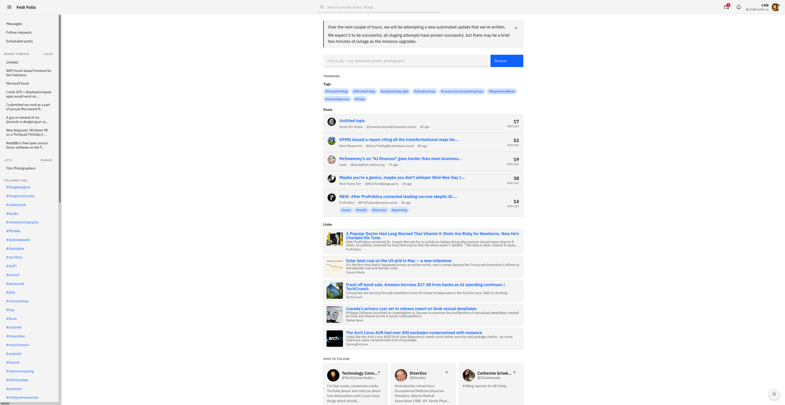

# mastoforum

A forum-style web client for Mastodon. Hashtags become boards, statuses
become threads with their reply tree intact. Sign in with any instance —
the app registers itself over OAuth, so there's nothing to configure
server-side.

## Stack

- React + TypeScript + Vite
- IBM Carbon
- TanStack Query
- masto
- DOMPurify

## Run

- `npm install`
- `npm run dev` — http://localhost:5173
- `npm test`
- `npm run build` — static site in `dist/`, deployable anywhere

Licensed [AGPL-3.0-or-later](./LICENSE).
