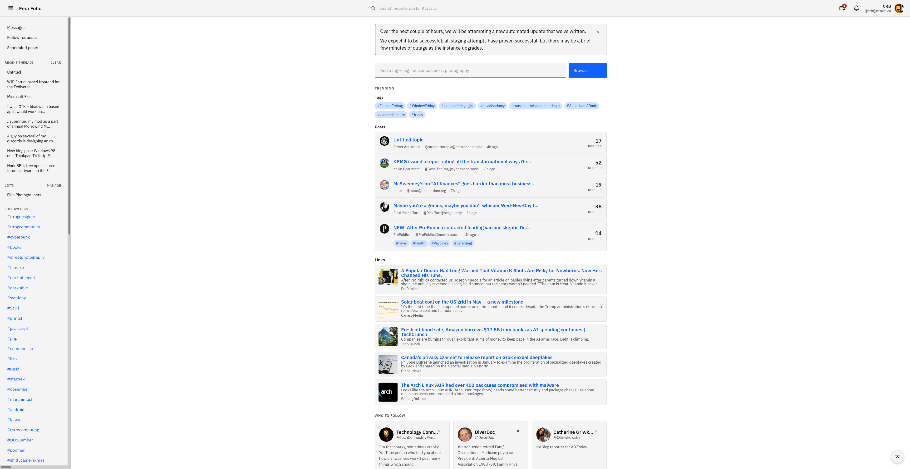

# mastoforum

A static page forum-style web client for Mastodon. 

- Hashtags become boards,
- Statuses become threads with their reply tree intact. 
- RPG/TTPRG dice roller option
- Feed list

Its kind of neat! :)

## Stack

- React + TypeScript + Vite
- IBM Carbon
- TanStack Query
- masto
- DOMPurify

## Run

- `npm install`
- `npm run dev` — http://localhost:5173
- `npm test`
- `npm run build` — static site in `dist/`, deployable anywhere

Licensed [AGPL-3.0-or-later](./LICENSE).

AI Notice: I have an AI agent look through it for security issues. 
